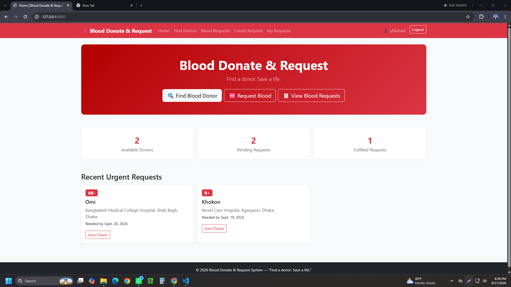
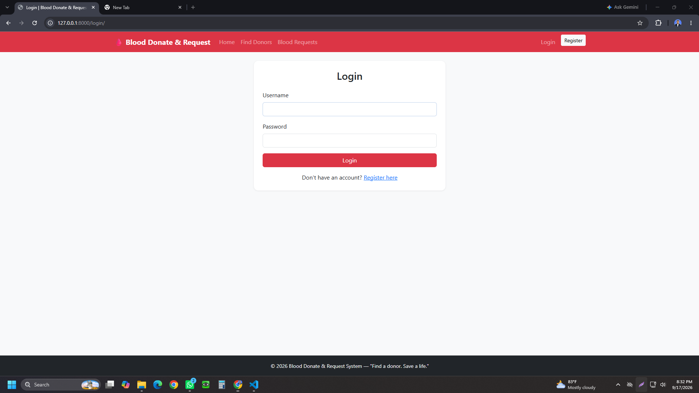
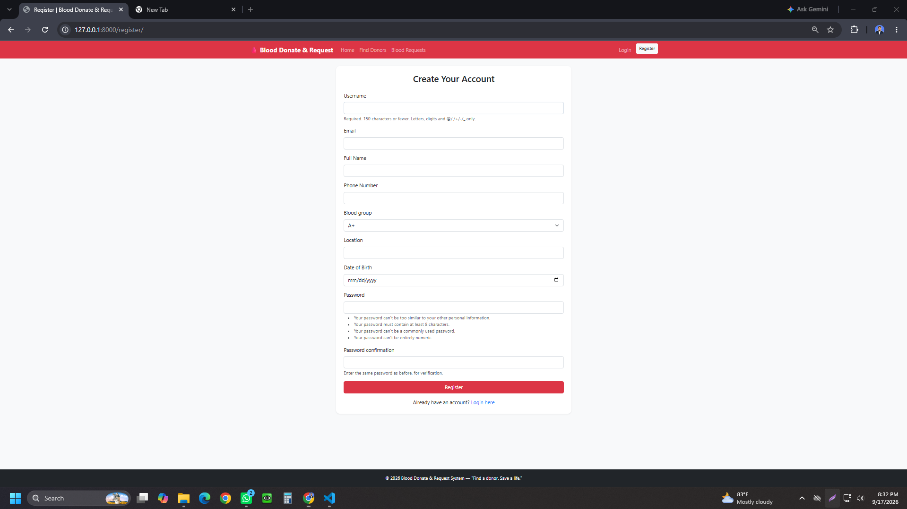
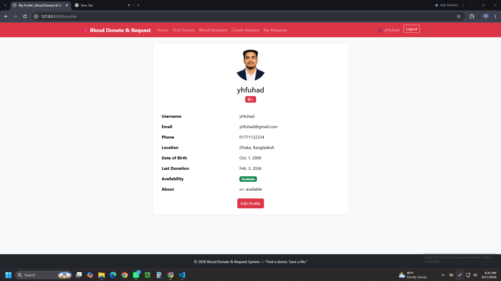
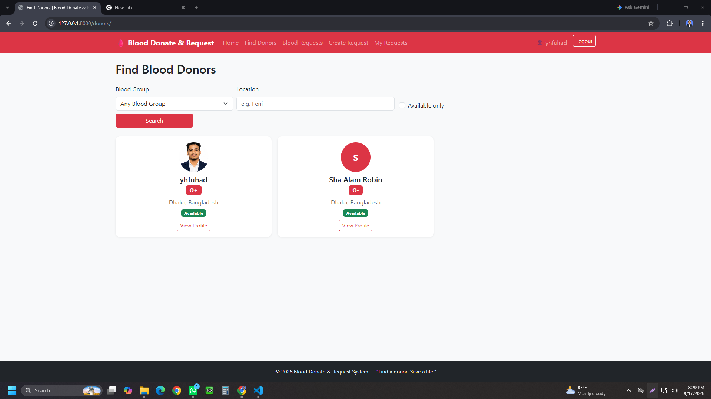
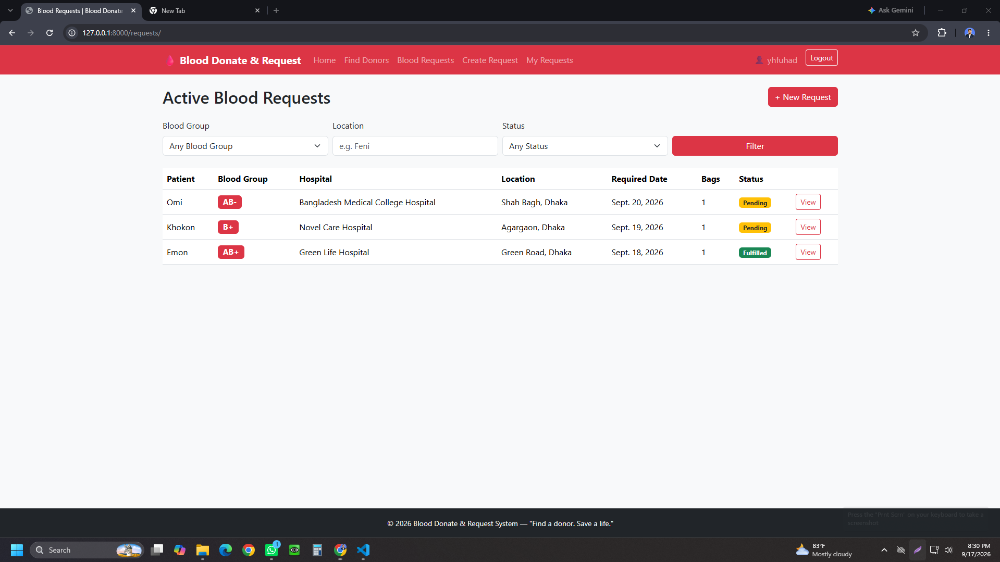
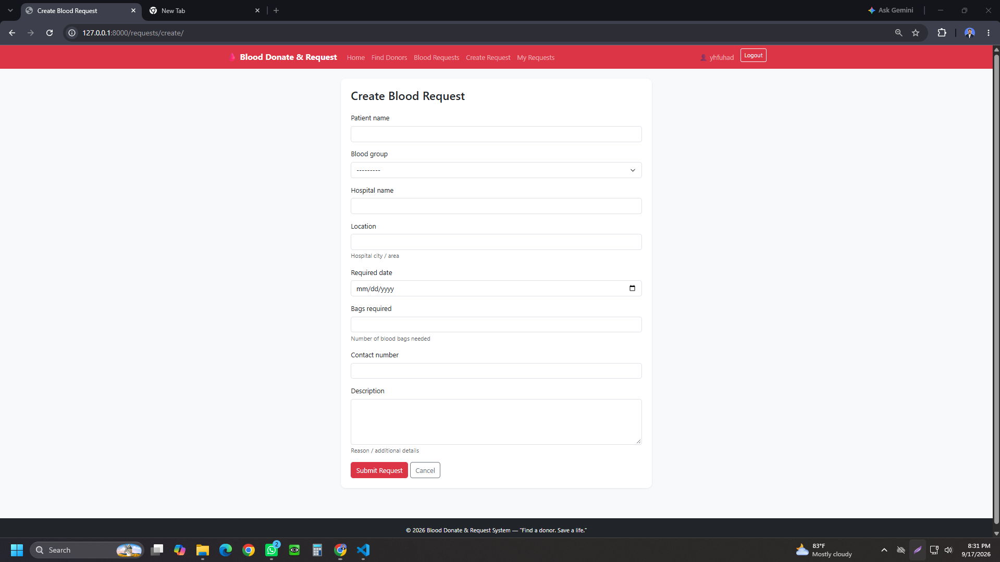
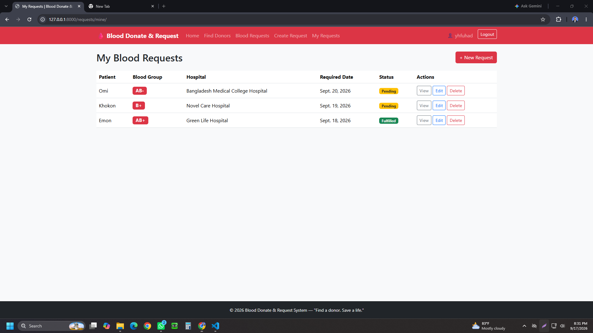

# 🩸 Blood Donate & Request System

A Django-based web application that connects blood donors with people who need blood. Users can register, create donor profiles, search for suitable donors, and create/manage blood requests.

> **"Find a donor. Save a life."**

## 📌 Project Overview

The **Blood Donate & Request System** is a practical CRUD-based Django project developed to demonstrate:

- Django Models
- Views and Templates
- Django Forms
- CRUD Operations
- Django ORM
- User Authentication
- Template Inheritance
- Form Validation
- Search and Filtering
- Static and Media Files
- Responsive UI

## ✨ Main Features

### 👤 User Authentication
- User Registration
- User Login / Logout
- User Profile
- Profile Update
- Authentication-protected pages

### 🩸 Donor Profile
- Create donor profile
- Blood group
- Phone number
- Location
- Last donation date
- Availability status
- Short description
- Edit and delete own donor profile

### 🏥 Blood Request
- Create blood request
- Patient information
- Required blood group
- Hospital name and location
- Required date
- Number of bags
- Contact number
- Request description
- Request status
- Edit and delete own requests

### 🔎 Donor Search
Donors can be filtered by:
- Blood Group
- Location
- Availability

### 📋 Blood Request Listing
Users can view active blood requests and filter them by:
- Blood Group
- Location
- Status

### 🔐 Access Control
Users can modify or delete only their own donor profiles and blood requests.

## 🛠️ Technologies Used

- **Python**
- **Django**
- **HTML5**
- **CSS3**
- **JavaScript**
- **Bootstrap**
- **SQLite**
- **Django ORM**
- **Git & GitHub**

## 📂 Project Structure

```text
blood_donate_system/
│
├── manage.py
├── requirements.txt
├── README.md
│
├── screenshots/
│   ├── Home.png
│   ├── Login.png
│   ├── Register.png
│   ├── Profile.png
│   ├── Find_Donors.png
│   ├── Blood_Requests.png
│   ├── Create_Request.png
│   └── My_Requests.png
│
├── <django_project>/
│   ├── settings.py
│   ├── urls.py
│   ├── asgi.py
│   └── wsgi.py
│
└── <app_name>/
    ├── migrations/
    ├── templates/
    ├── static/
    ├── models.py
    ├── views.py
    ├── forms.py
    ├── urls.py
    └── admin.py
```

## 📸 Project Screenshots

### 🏠 Home Page


### 🔐 Login Page


### 📝 Registration Page


### 👤 User Profile


### 🔎 Find Blood Donors


### 🩸 Blood Requests


### ➕ Create Blood Request


### 📋 My Requests


## ⚙️ Installation & Setup

### 1. Clone the repository

```bash
git clone https://github.com/yeaminhossainfuhad-cloud/blood_donate_system.git
cd blood_donate_system
```

### 2. Create a virtual environment

**Windows:**

```bash
python -m venv venv
venv\Scripts\activate
```

**Linux / macOS:**

```bash
python3 -m venv venv
source venv/bin/activate
```

### 3. Install dependencies

```bash
pip install -r requirements.txt
```

### 4. Apply migrations

```bash
python manage.py makemigrations
python manage.py migrate
```

### 5. Create a superuser

```bash
python manage.py createsuperuser
```

### 6. Run the development server

```bash
python manage.py runserver
```

Open the application in your browser:

```text
http://127.0.0.1:8000/
```

## 🗃️ Core Database Models

### DonorProfile

Typical fields:

```text
user
blood_group
phone
location
last_donation_date
availability
description
```

### BloodRequest

Typical fields:

```text
requester
patient_name
blood_group
hospital_name
location
required_date
bags_required
contact_number
description
status
created_at
```

## 🧪 CRUD Operations

| Feature | Create | Read | Update | Delete |
|---|:---:|:---:|:---:|:---:|
| Donor Profile | ✅ | ✅ | ✅ | ✅ |
| Blood Request | ✅ | ✅ | ✅ | ✅ |

## ✅ Validation

The project includes basic validation such as:

- Required fields cannot be empty
- Blood group is selected from predefined choices
- Number of bags must be positive
- Required date must be valid
- Phone number follows a reasonable format

## 🎯 Learning Objectives

This project demonstrates practical implementation of Django concepts learned during the course, including:

1. Creating Django models
2. Designing database relationships
3. Building forms
4. Handling CRUD operations
5. Using Django ORM
6. Implementing authentication
7. Restricting user-owned data
8. Creating reusable templates
9. Implementing search and filtering
10. Managing static and media files

## 🚀 Future Improvements

Possible future enhancements:

- Pagination
- AJAX-based donor search
- Email notifications
- Donor request/response system
- Blood group compatibility information
- Request priority
- Dashboard statistics
- Improved responsive design
- Admin dashboard customization

## 👨‍💻 Author

**Md Yeamin Hossain Fuhad**

- Diploma in Engineering in Computer Science & Technology
- B.Sc. in Computer Science & Engineering — World University of Bangladesh
- Interested in **SQA, Python/Django Development, and IT Support**

## 📄 License

This project was developed for educational and academic purposes.
